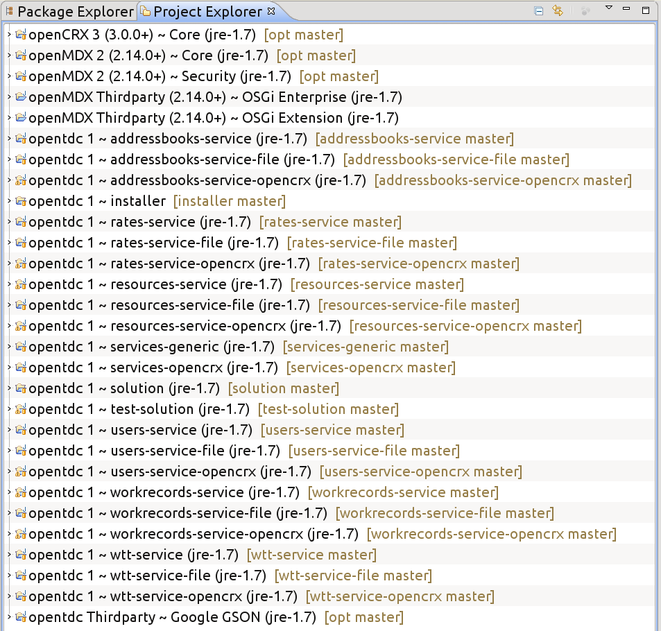
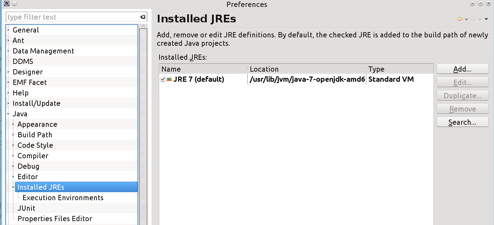

# solution

## Build

Prerequsites:

* JDK 7 must be installed
* ant must be installed

		export CXF_HOME='path to CXF home directory'
		cd solution
		ant clean
		ant assemble

This builds the WARs at jre-1.7/solution/deployment-unit/ containing
the (JAX-RS compliant) middletier services:

* opentdc-services-test.war: used for testing purposes and uses the 
  file service providers as backend (see web.xml for more details)
* opentdc-services.war: used as template for production use and uses
  the main service providers (such as openCRX) as backend (see web.xml
  for more details).
  
Copy the war-files manually into the installer project:

		cd opentdc
		cp jre-1.7/solution/deployment-unit/*.war installer/src/docker/opentdc-services/1.0/files
		
If you do not want to build the project, it is sufficient to clone the project 'installer'.
It already contains the war-files in a current version.

## Run Docker / JUnits

### Container opentdc-opencrx

Backend-Container running openCRX.

		cd opentdc/installer/src/docker/opencrx/3.0
		sudo docker build -t opencrx:latest .
		cd opentdc/installer/src/docker/opentdc-opencrx/3.0
		sudo docker build -t opentdc-opencrx:latest .
		sudo docker run -d -p 8080:80 -p 8009:8009 -p 1143:1143 -p 1389:1389 -p 8001:8001 --name opentdc-opencrx opentdc-opencrx:latest
		sudo docker logs -f opentdc-opencrx

### opentdc-services

Container running the middletier services (e.g. opentdc-services.war, opentdc-services-test.war).
This container is linked to the opentdc-opencrx container using the --link option.

		cd opentdc/installer/src/docker/opentdc-services/1.0
		sudo docker build -t opentdc-services:latest .
		sudo docker run -d -p 9080:80 -p 9009:8009 -p 9001:8001 --name opentdc-services --link opentdc-opencrx:opentdc-opencrx
		opentdc-services:latest
		sudo docker logs -f opentdc-services

### Other Operating Systems than Linux
On Mac OS/X or Windows, [boot2docker](http://boot2docker.io) is needed, a lightweight Linux distribution based on Tiny Core Linux made specifically to run Docker containers. It runs completely from RAM, weighs 27 MB and boots in 5s.
The instructions to install the docker containers are the same as above with the following exceptions:
* run the commands from within boot2docker
* sudo is not needed
* get the IP address of the boot2docker VM with 'boot2docker ip' (instead of localhost)

### Running JUnits

Testing the file service providers with:

		cd test-solution
		ant -Dservice.url="http://localhost:9080/opentdc-services-test/" test
on Mac or Windows:
		cd test-solution
		ant -Dservice.url="http://`boot2docker ip`:9080/opentdc-services-test/" test

Testing the main service providers with:

		cd test-solution
		ant -Dservice.url="http://localhost:9080/opentdc-services/" test

## Eclipse

All projects come with .project / .classpath files. You can import them in
Eclipse.

